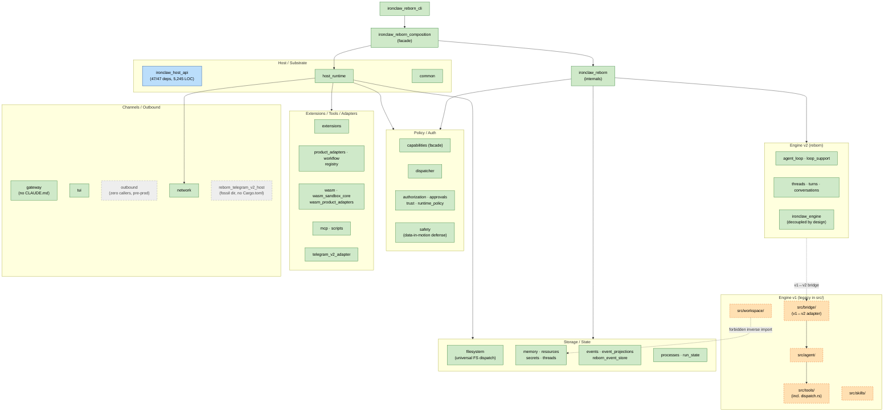
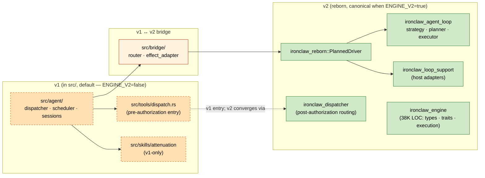
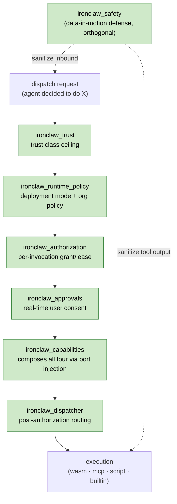
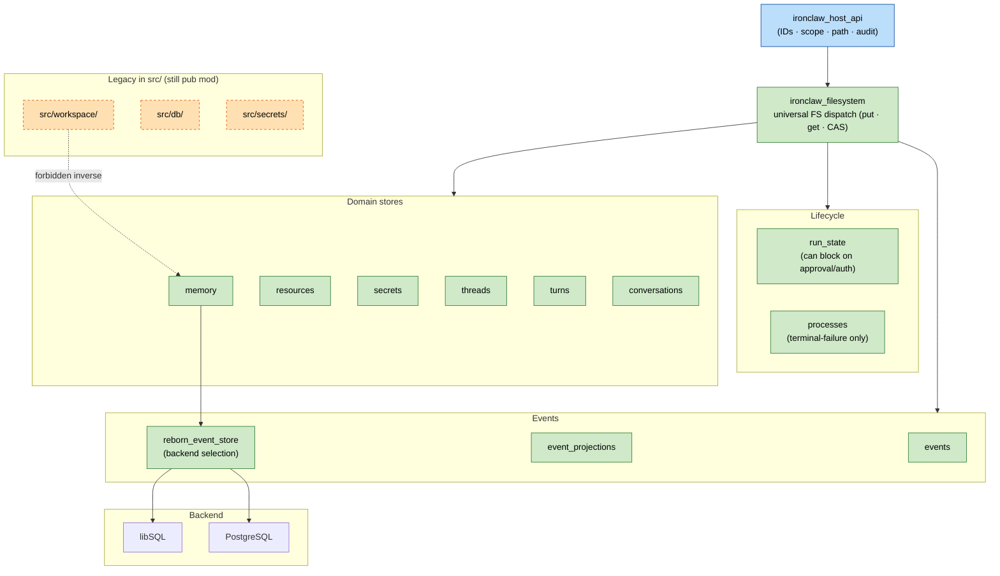
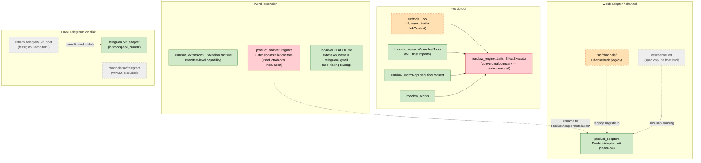
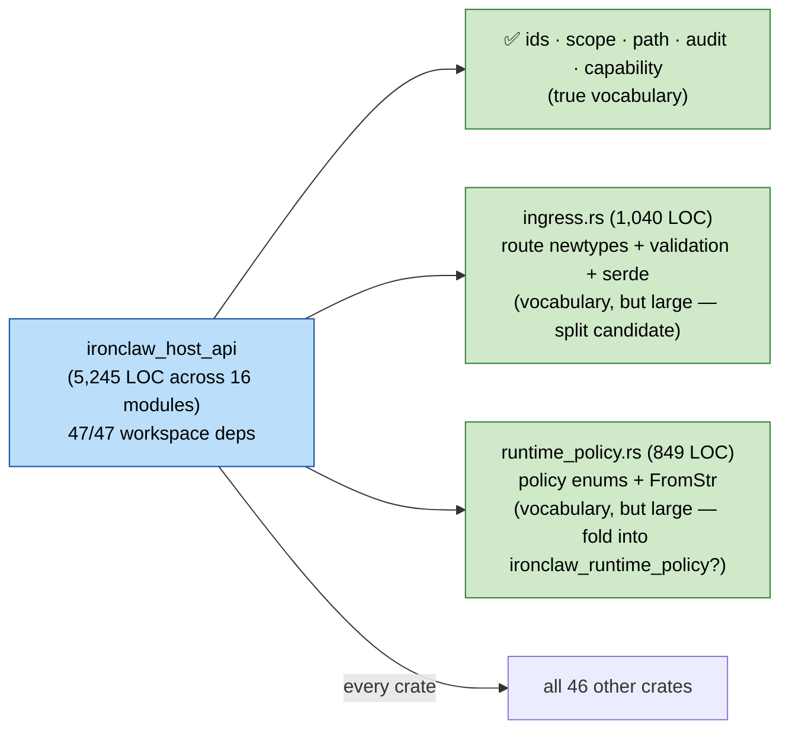

# Crate Boundary & Ownership Audit — reborn-integration

**Date:** 2026-05-18
**Branch:** `reborn-integration` (~690 commits ahead of `main`)
**Scope:** all 47 workspace crates + the legacy `src/` tree
**Purpose:** surface ambiguous ownership so the team can resolve it async, update CLAUDE.md / AGENTS.md, and direct autonomous agents at clearly-scoped gaps.

This is a findings + proposed resolution document. Each "Proposed resolution" is a starting position for team discussion, not a decided plan.

---

## TL;DR

- One **P0 security-class** finding stands out from the rest: the caller's `trust_decision` is silently dropped at the host-runtime layer (see **I2** below). Triage as a security ticket before anything else.
- The reborn migration is roughly half-done. Several `src/<x>/` modules (`src/agent/`, `src/tools/`, `src/workspace/`, `src/skills/`) coexist with their reborn replacements with no documented v1/v2 status matrix. **`ENGINE_V2` ships as `false` by default**, so v1 is live, not just maintained.
- Several concepts have 3–4 parallel names with no shared owner-doc: "extension" vs "product_adapter" vs "channel" vs "tool"; "memory" vs "workspace" vs "resources" vs "run_state".
- `ironclaw_host_api` is depended on by every workspace crate (47/47) at 5,245 LOC. The contents are vocabulary (newtypes + enums + serde), not concrete behavior — but the total size still warrants a split discussion.
- **The biggest documentation-drift bug in the repo is not in any CLAUDE.md** — `crates/AGENTS.md` and `crates/README.md` both still list `ironclaw_storage` as an active crate. It was dissolved in commit `06090f4e6`. These are the first files a new contributor reads.
- `ironclaw_outbound` is fully specified with a comprehensive `CLAUDE.md` but has zero workspace consumers — pre-production scaffolding waiting on integration.
- `crates/ironclaw_reborn_telegram_v2_host/` is a fossil directory with no `Cargo.toml`, on disk since the consolidation in `af0ef699e`.
- `src/workspace/reborn_identity_context.rs` imports `ironclaw_memory::DEFAULT_PROMPT_PROTECTED_PATHS` despite `ironclaw_memory/CLAUDE.md` forbidding the inverse direction — undeclared v1→v2 bootstrap shim.

---

## Recommended order of work

The cheapest, most durable fixes first.

1. **Triage I2 as a security review item** — separate ticket, separate owner. Don't bundle with cleanup work.
2. **Add the missing architecture tests.** Every "NEITHER" row in the coverage matrix is a ~20-line `cargo metadata` test in `crates/ironclaw_architecture/tests/`. Tests are durable; CLAUDE.md text decays. The lowest-hanging six:
   - D1 (workspace→memory inverse-import test)
   - D4 (Process/Run status type duplication check)
   - G1 (zero-callers reachability test for `ironclaw_outbound`)
   - G2 (fossil-directories test — entries in `crates/` not in `members` and not in `exclude`)
   - F1 (host_api LOC + dep count census)
   - B1 (substrate crates must not import `ironclaw_reborn` directly)
3. **Fix `crates/AGENTS.md` and `crates/README.md`** — both still list `ironclaw_storage` as an active crate. Highest-leverage docs fix because new contributors read these first.
4. **Convert the 3 deferred follow-ups from `24c7051d2` into tracked issues** — already scoped, just need owners:
   1. `ironclaw_secrets` master-key decryptability check on `FilesystemSecretStore` (blocks LibSql/Postgres deletion).
   2. `ironclaw_authorization` `FilesystemCapabilityLeaseStore` move from `&'a ScopedFilesystem` to `Arc<ScopedFilesystem>`.
   3. `ironclaw_run_state` migration to unified filesystem dispatch.
5. **Status matrix** — single section in top-level `CLAUDE.md` listing every crate + `src/<x>/` module as **canonical / legacy(v1) / shim / frozen / orphan**. Useful for autonomous-agent legibility once #2 enforces the boundaries.
6. **CLAUDE.md required per crate** — several workspace crates have none today (`ironclaw_gateway`, `ironclaw_network`). Make CLAUDE.md a workspace-level invariant.
7. **Glossary at `docs/GLOSSARY.md`** — define overloaded terms (extension, product adapter, channel, tool, lease, policy, capability, process, run, turn, thread, conversation), each naming the canonical owning crate.

---

## Diagrams

Color legend:

| Style | Meaning |
| --- | --- |
| 🟩 Green solid | Canonical / current reborn-era owner |
| 🟧 Orange dashed | Legacy v1 (still in tree, partially active) |
| 🟨 Yellow dashed | Shim (re-export only, no logic) |
| ⬜ Gray dashed | Orphan / fossil / zero callers |
| 🟦 Blue solid | Hub crate (every crate depends on it) |
| 🟥 Red border | Boundary violation surfaced by audit |

### 1. Workspace cluster map

The 47-crate workspace grouped by responsibility. Only the most representative crate per cluster is named; cross-cluster arrows show major composition lines.

### 2. Engine v1 ↔ v2 layering

What runs the agent loop today, and where the v1↔v2 seam lives. `ironclaw_engine` and `ironclaw_agent_loop` are both substantial canonical crates; the bridge in `src/bridge/` is where v1 callers cross into v2.

### 3. Policy / auth decision pipeline

Logical decision order. The actual call order is composed via port injection in `CapabilityHost`; types are not unified by a shared trait but are sequenced by the composition root.

### 4. Storage / state model

`ironclaw_filesystem` is the universal FS-dispatch substrate as of the May 2026 dissolution work. Domain stores layer on top; `reborn_event_store` selects the backing database (libSQL / Postgres).

The red arrow is a real boundary violation: `src/workspace/reborn_identity_context.rs` imports `ironclaw_memory::DEFAULT_PROMPT_PROTECTED_PATHS` despite `ironclaw_memory/CLAUDE.md` forbidding the inverse.

### 5. Extension / tool / adapter / channel concept map

Four names, several crates, three Telegram implementations on disk.

### 6. `ironclaw_host_api` fan-in

Every workspace crate depends on `host_api`. Total 5,245 LOC across 16 modules. The contents are vocabulary — newtypes, enums, validation, serde — but the size warrants a split discussion.

---

## Priority 0 — Security ticket

### I2. Caller's `trust_decision` is destructured and dropped at host_runtime

`HostRuntimeLoopCapabilityPort::invoke_capability` (`loop_support/src/capability_port.rs:817`) reads `provider_trust` and passes a `trust_decision` field into `RuntimeCapabilityRequest`. `DefaultHostRuntime::invoke_capability` (`host_runtime/src/production.rs:248`) destructures it as `_caller_trust_decision` (the underscore = intentionally discarded) and re-evaluates trust locally via `self.evaluate_invocation_trust`.

The host being authoritative on trust is correct design. **But the public field is plumbed through the API and silently dropped at the consumer.** A future contributor wiring a custom `LoopCapabilityPort` could pass a carefully-constructed `trust_decision` and never see it applied — masking a downstream security regression.

**Proposed resolution.** Pick one:
1. Remove the `trust_decision` field from `RuntimeCapabilityRequest` entirely (preferred — fewer dead fields means fewer assumptions to maintain).
2. Rename to `_advisory_trust_decision` and add a `#[doc]` warning that the host re-evaluates and the field is for logging only.
3. Use the caller's decision when present and skip re-evaluation.

Owner: host_runtime + security review.

---

## Architecture-test coverage matrix

`crates/ironclaw_architecture/tests/` already encodes 22 boundary assertions. The matrix below shows which findings in this audit are already enforced, partially enforced, or not enforced.

| Finding | Status | Note |
|---|---|---|
| A1 agent-loop ownership | NEITHER | No test pins which crate owns which responsibility |
| A2 dispatcher v1 vs v2 | NEITHER | No test |
| A3 tool-trait fragmentation | NEITHER | `EffectExecutor` exists but the boundary isn't asserted |
| A4 skills v1-only marker | NEITHER | No deprecation enforcement (correctly deferred — see A4) |
| A5 `src/bridge/` Project Structure row | NEITHER | Doc gap only |
| B1 reborn vs reborn_composition | **PARTIAL** | `reborn_composition_boundaries.rs:38-105` enforces upward isolation; does NOT forbid substrate crates from importing `ironclaw_reborn` directly |
| B2 event-crate naming | NEITHER | Doc question, not enforcement |
| B3 RebornCompositionProfile location | NEITHER | Convenience re-export question |
| C1 capabilities DI pattern | n/a | Verified consistent — `ironclaw_dispatcher` is in `[dev-dependencies]` |
| C2 policy composition order | NEITHER | No order-of-operations test |
| C3 lease ownership | NEITHER | Not asserted |
| C4 safety scope | n/a | Withdrawn — scope is cohesive |
| C5 runtime_policy re-exports | NEITHER | Doc gap only |
| D1 workspace→memory inverse | NEITHER | Architecture test would catch this |
| D2 src/db, src/workspace `pub mod` | NEITHER | No module-status test |
| D3 src/secrets coexistence | NEITHER | No canonical picker |
| D4 ProcessStatus vs RunStatus | NEITHER | No unified-type test |
| D5 SessionThreadService re-export | n/a | Withdrawn — clean re-export pattern |
| E1 "extension" overload | NEITHER | No naming-consistency test |
| E2 ProductAdapter vs Channel | NEITHER | No authority test |
| E3 / G2 fossil dirs | NEITHER | A "directories in `crates/` not in members AND not in exclude" check would catch this |
| E4 three WASM crates | **ASSERTED** | `reborn_dependency_boundaries.rs:621-850` (7 tests) |
| E5 channel ownership | NEITHER | No role test |
| F1 host_api LOC/dep census | NEITHER | No size-budget test |
| F2 host_api vs host_runtime | **PARTIAL** | `reborn_dependency_boundaries.rs:171-328` enforces substrate-handle leak only |
| F3 event_projections→memory | n/a | Withdrawn — imports are read-model trait targets, correct architecture |
| G1 outbound zero callers | NEITHER | No reachability test |
| G3 src/tunnel no crate | NEITHER | Not asserted |
| H1 network naming | n/a | Withdrawn — scope is narrow by design |
| I1 WasmRuntimeAdapter in wrong crate | NEITHER | No "no `impl RuntimeAdapter for *` in host_runtime" test |
| I2 trust dropped | NEITHER | Security ticket — see P0 above |
| I3 capability double-lookup | NEITHER | Not asserted |
| I4 WasmHostTools wiring contract | NEITHER | Default deny works; production wiring undocumented |
| I5 dual event logs | NEITHER | Not asserted |
| I6 request-shape drift | NEITHER | No type-chain test |
| W1 channel.wit orphaned | NEITHER | No host-impl reachability check |
| W2 tool WIT version pinning | NEITHER | Documentation parity with `wasm_product_adapters` |
| W3 ProductAdapter http-egress stub | NEITHER | Documented as deferred in CLAUDE.md |
| W4 tool-invoke gating contract | NEITHER | Default deny works; production wiring undocumented |

**Three bonus boundaries already asserted (not in the 25 findings but worth knowing about):**

- `reborn_cli_binary_crate_stays_separate_from_v1_root` — CLI must enter only via composition + config.
- `reborn_boot_config_file_layout_is_pinned` — `~/.ironclaw/config.toml` and `providers.json` paths are durable contracts.
- `reborn_turns_public_surface_uses_turn_ids_not_runtime_or_process_ids` — prevents ID-abstraction leakage.

---

## Documentation contradictions

Doc files that claim X while code does Y. Verified.

| Sev | Claim | Claimed in | Broken by |
|---|---|---|---|
| HIGH | `crates/` map lists `ironclaw_storage` as an active crate | `crates/AGENTS.md`, `crates/README.md` | Commit `06090f4e6` dissolved the crate; it is gone from the workspace |
| HIGH | `ironclaw_memory` forbids depending on `src/workspace` (and inverse) | `ironclaw_memory/CLAUDE.md:6` | `src/workspace/reborn_identity_context.rs:11` imports `ironclaw_memory::DEFAULT_PROMPT_PROTECTED_PATHS` |
| MED | Telegram host was consolidated into the reborn binary | Commit `af0ef699e` body | `crates/ironclaw_reborn_telegram_v2_host/` still on disk |
| MED | `ironclaw_outbound` has a comprehensive CLAUDE.md describing expected callers | `ironclaw_outbound/CLAUDE.md` | Zero workspace consumers |
| MED | `src/bridge/` is the v2 adapter authority | `src/bridge/CLAUDE.md` | Top-level `CLAUDE.md` Project Structure + Module Specs tables don't list it |
| MED | `src/db` + `src/workspace` slated for dissolution | Commit `06090f4e6` + planned legacy-store cleanup | `src/lib.rs` still `pub mod` with no deprecation marker |

---

## Findings by theme

### Theme A — Engine v1 ↔ v2 migration is mid-flight

`ENGINE_V2` defaults to `false`. v1 (`src/agent/`, `src/tools/`, `src/skills/`) is shipping, not just maintained. v2 (`ironclaw_reborn`, `ironclaw_agent_loop`, etc.) is the canonical path when the flag flips. Nothing in top-level `CLAUDE.md` tells a new contributor (or an autonomous agent) which surface to extend.

#### A1. Agent loop ownership across four crates / modules

**Ambiguity.** `src/agent/` (~31 KB) is the v1 dispatcher/scheduler/session-manager. `ironclaw_agent_loop` owns v2 strategy/planner/executor. `ironclaw_engine` (38K LOC, intentionally decoupled — only two direct deps because it doesn't depend on the host crate) owns the state-machine vocabulary and types. `ironclaw_reborn::PlannedDriver` is the adapter. A contributor adding "fallback when a tool times out" has four plausible homes.

**Evidence.** `src/agent/mod.rs:1-16`, `crates/ironclaw_engine/CLAUDE.md`, `crates/ironclaw_agent_loop/Cargo.toml:6`, `crates/ironclaw_reborn/src/lib.rs:1-35`.

**Proposed resolution.** Add a "v1 vs v2 engine status" section to top-level `CLAUDE.md`. Document each layer in its own CLAUDE.md: `ironclaw_engine` = state-machine types and traits; `ironclaw_agent_loop` = orchestration strategy; `ironclaw_reborn` = composition adapter. Cross-link to the engine v2 architecture plan in `docs/plans/`.

#### A2. Tool dispatcher: v1 entry point vs v2 post-authorization router

**Ambiguity.** `src/tools/dispatch.rs::ToolDispatcher::dispatch()` is the v1 channel-agnostic entry point (creates a job context, validates schema, executes). `ironclaw_dispatcher::RuntimeDispatcher` is the v2 post-authorization routing gate. They're at different pipeline stages but the cross-reference is missing.

**Evidence.** `src/tools/dispatch.rs:1-50`, `crates/ironclaw_dispatcher/src/lib.rs:1-6`, `crates/ironclaw_dispatcher/CLAUDE.md`.

**Proposed resolution.** Declare in top-level `CLAUDE.md`: `src/tools/dispatch.rs` is v1 pre-authorization; `ironclaw_dispatcher` is v2 post-authorization. The v2 path is `CapabilityHost::invoke_json` → `RuntimeDispatcher::dispatch_json`. Plan removal of `src/tools/dispatch.rs` once `ENGINE_V2=true` is the default.

#### A3. Tool runtimes converge at `EffectExecutor` but the boundary isn't asserted

**Ambiguity.** The four tool runtimes — `src/tools::Tool`, `ironclaw_wasm::WasmHostTools`, `ironclaw_mcp::McpExecutionRequest`, `ironclaw_scripts` — all eventually meet at the `EffectExecutor` trait in `ironclaw_engine/traits/effect.rs`. The trait exists; the convergence isn't documented at any of the runtime crates.

**Proposed resolution.** Add to each runtime crate's `CLAUDE.md`: "All runtimes implement `ironclaw_engine::traits::EffectExecutor`. The composition wires them into the host's `ToolRegistry`." Add an architecture test asserting every tool runtime crate has an `impl EffectExecutor`.

#### A4. Skills attenuation is v1-only but currently load-bearing

**Ambiguity.** `src/skills/mod.rs:13-26` documents that `attenuation` and `bundled` are v1-only and "can be deleted once v1 is gone." No `#[deprecated]` attribute. `src/agent/dispatcher.rs:276,488` calls `attenuate_tools()` unconditionally. Adding `#[deprecated]` now would be premature because `ENGINE_V2=false` is the shipping default — the code is actively used.

**Proposed resolution.** File a tracking issue tied to the `ENGINE_V2=true` cutover. When the flag flips, add `#![deprecated(since = "v1-sunset", note = "...")]` to `src/skills/mod.rs` and `#[allow(deprecated)]` at the v1 callsites.

#### A5. `src/bridge/` is missing from top-level CLAUDE.md tables

**Ambiguity.** `src/bridge/` is the v1↔v2 adapter with its own `CLAUDE.md` and clear responsibilities (auth, effects, LLM, store). It's mentioned in top-level `CLAUDE.md` prose ("Auth Invariants" section) but absent from the Project Structure table and the Module Specs table — the two places a new contributor scans first.

**Proposed resolution.** Add a `src/bridge/` row to both tables in top-level `CLAUDE.md`. Cross-link `src/bridge/CLAUDE.md`. Also clarify in `src/bridge/CLAUDE.md` whether bridge is a v1-sunset artifact or a permanent adapter layer.

### Theme B — Reborn-vs-non-reborn naming

#### B1. Inverse-direction architecture test missing for `ironclaw_reborn`

**Ambiguity.** `ironclaw_reborn/src/lib.rs` header declares the crate internal-only; only `ironclaw_reborn_composition` is a sanctioned consumer. Three architecture tests at `reborn_composition_boundaries.rs:38-105` enforce upward isolation (substrate crates don't depend on composition) — but no test forbids substrate crates from importing `ironclaw_reborn` directly without going through the facade.

**Proposed resolution.** Add an architecture test in `reborn_dependency_boundaries.rs`: no workspace crate other than `ironclaw_reborn_composition` may declare `ironclaw_reborn` as a dependency.

#### B2. Event-crate naming clarification

**Ambiguity.** `ironclaw_events` (substrate), `ironclaw_event_projections` (read-model bridge), and `ironclaw_reborn_event_store` (backend selection) — three crates, only one prefixed `reborn_*`. Production wires only the reborn store. The names are accurate for design but unclear at a glance.

**Proposed resolution.** Document in each crate's CLAUDE.md that the substrate (`events`) and projections are deliberately reborn-agnostic to allow a hypothetical future v2-next substrate to plug in. Do **not** rename — that would lock the names to the current consumer.

#### B3. `RebornCompositionProfile` convenience re-export

**Ambiguity.** `RebornCompositionProfile` (Disabled/LocalDev/Production/MigrationDryRun) lives in `ironclaw_reborn_composition::profile`. Outer harnesses that just need the enum must depend on the composition crate.

**Proposed resolution.** Add a convenience re-export of `RebornCompositionProfile` from `ironclaw_reborn_config`. Don't move the type — composition profiles belong in the composition crate.

### Theme C — Policy / auth concept layout

Six crates (`safety`, `trust`, `authorization`, `capabilities`, `approvals`, `runtime_policy`, `dispatcher`) carry pieces of "what can run." The shared vocabulary is `ironclaw_host_api`. Composition order is sequenced in `CapabilityHost` via port injection, not a marker trait.

#### C1. Document the port-injection DI pattern

**Ambiguity.** `ironclaw_capabilities` composes `approvals + authorization + dispatcher + filesystem + events + resources` via port traits injected by the outer composition root. The concrete implementations only appear in `[dev-dependencies]` so tests can wire them. The pattern is healthy but the design intent isn't documented.

**Proposed resolution.** Add a "DI pattern" paragraph to `ironclaw_capabilities/CLAUDE.md` explaining the port-injection model. It's a good template for other facade crates.

#### C2. Document composition order

**Ambiguity.** Three policy types (`EffectiveTrustClass`, `EffectiveRuntimePolicy`, `CapabilityLease`) live in `ironclaw_host_api`'s vocabulary. The composition order (trust → runtime policy → grant/lease) is encoded only in the caller's orchestration (`capabilities/src/host.rs:183`). A new policy layer could be added without authors knowing where it fits.

**Proposed resolution.** Add `crates/ironclaw_authorization/POLICY-COMPOSITION.md` documenting the order with example flows. Optionally add an architecture test asserting the call sequence inside `CapabilityHost::invoke_json`.

#### C3. Formalize lease ownership

**Ambiguity.** `CapabilityLease` is defined in `ironclaw_authorization` (`src/lib.rs:167-192`). `ironclaw_approvals::ApprovalResolver::approve_dispatch()` calls `leases.issue(...)`. If a new approval flavor wants a lease subtype, it's unclear which crate owns the definition.

**Proposed resolution.** Formalize in `ironclaw_authorization/CLAUDE.md`: all lease types are defined here; `ironclaw_approvals` depends on the `CapabilityLeaseStore` trait only, not on concrete lease construction.

#### C4. Note `runtime_policy` re-export asymmetry

**Ambiguity.** `ironclaw_runtime_policy/src/lib.rs:44-47` re-exports only `EffectiveRuntimePolicy` (because it appears in the resolver's return type) while telling callers to import other vocab from `host_api`. A caller hitting `ironclaw_runtime_policy::RuntimePolicy` (doesn't exist) will be confused.

**Proposed resolution.** Add a banner comment at the top of `lib.rs`: "Types live in `ironclaw_host_api::runtime_policy::*` except `EffectiveRuntimePolicy`, which is re-exported here for return-type ergonomics."

#### C5. Document `CapabilityHost` optional-traits pattern

**Ambiguity.** `CapabilityHost` is composed via optional `with_*` builders (`capabilities/src/host.rs:73-130`). Traits are expected to fail gracefully if missing (e.g., `run_state.start()` is best-effort). The optional/required distinction isn't documented.

**Proposed resolution.** Add to `ironclaw_capabilities/CLAUDE.md`: "Traits passed via `with_*` builders are optional and must fail-soft when absent. Do not promote an optional trait to a required field without updating outer harnesses."

### Theme D — Storage / state crate layout

#### D1. `src/workspace/` imports `ironclaw_memory` despite memory forbidding the inverse

**Ambiguity.** `src/workspace/reborn_identity_context.rs:11` imports `ironclaw_memory::DEFAULT_PROMPT_PROTECTED_PATHS`. `ironclaw_memory/CLAUDE.md:6` forbids depending on `src/workspace` in either direction. The filename signals "v1→v2 bootstrap" but no comment confirms it.

**Proposed resolution.** Either (a) move `DEFAULT_PROMPT_PROTECTED_PATHS` to `ironclaw_common` or `ironclaw_host_api` so both layers can depend on it without violating the inverse rule, or (b) add a comment in `reborn_identity_context.rs` declaring this as a temporary v1→v2 bridge with a tracking issue. Add an architecture test enforcing whichever resolution is chosen.

#### D2. Legacy `src/db/` and `src/workspace/` lack a documented status

**Ambiguity.** `src/lib.rs:52,89` still `pub mod db` and `pub mod workspace`. Recent commits (`06090f4e6` dissolved `ironclaw_storage`; `f95288c16` introduced universal FS dispatch) suggest they're being phased out. Status (active / shimmed / frozen) isn't declared.

**Proposed resolution.** Add a "Legacy Modules" section to top-level `CLAUDE.md` enumerating each `src/` module by status. Once the cross-cutting status matrix lands, this drops into it.

#### D3. `src/secrets/` and `crates/ironclaw_secrets/` have no documented relationship

**Ambiguity.** Both contain full implementations (`src/secrets/`: 489 LOC; `crates/ironclaw_secrets/`: 2,053 LOC). Neither documents which is authoritative for new code. This is blocked on the `ironclaw_secrets` follow-up from `24c7051d2`.

**Proposed resolution.** Add `src/secrets/CLAUDE.md` declaring `src/secrets/` as the v1 implementation, `crates/ironclaw_secrets/` as v2-canonical. Document the migration deadline tied to the `EncryptedBackend` follow-up.

#### D4. `ProcessStatus` vs `RunStatus` semantic boundary

**Ambiguity.** `ironclaw_processes::ProcessStatus` has 4 states (`Running/Completed/Failed/Killed`); `ironclaw_run_state::RunStatus` has 5 (`Running/BlockedApproval/BlockedAuth/Completed/Failed`). Both CLAUDE.md files document their scope but cross-references are missing.

**Proposed resolution.** Add a cross-reference paragraph to each CLAUDE.md: `run_state` owns invocation-wide lifecycle (can block on approval/auth); `processes` owns isolated capability process state (terminal-failure only). Composition fuses them via `(invocation_id, process_id)` tuples.

### Theme E — Extension / tool / adapter / channel concept overload

#### E1. Rename `Extension*` types in product_adapter_registry

**Ambiguity.** `ironclaw_product_adapter_registry` uses `Extension` in type names (`ExtensionInstallationStore`, `ExtensionActivationState`, `ExtensionCredentialBinding`) but the records describe *ProductAdapter installations*. The naming reads as a third meaning of "extension" — a strict reading shows they're the broader manifest concept, but the naming creates avoidable noise.

**Proposed resolution.** Rename to `ProductAdapterInstallationStore` / `ProductAdapterInstallationState` / `ProductAdapterCredentialBinding`. Reserve "extension" for the manifest-level capability concept (`ironclaw_extensions::ExtensionRuntime`) and the user-facing routing identity in top-level `CLAUDE.md`.

#### E2. Declare ProductAdapter canonical; Channel legacy

**Ambiguity.** `ironclaw_product_adapters` defines `ProductAdapter` (native or WASM). `wit/channel.wit` declares a parallel `channel-host` interface with no host implementation. `src/channels/` carries the v1 `Channel` trait. New integrations should use ProductAdapter; the migration path isn't documented.

**Proposed resolution.** Add to `crates/ironclaw_product_adapters/CLAUDE.md`: "ProductAdapter (`ironclaw.product_adapter/v1`) is the canonical extension surface. The v1 `src/channels/Channel` trait and the unimplemented `wit/channel.wit` are legacy paths; do not add new integrations to either."

#### E3. Delete the `reborn_telegram_v2_host` fossil directory

**Ambiguity.** `crates/ironclaw_reborn_telegram_v2_host/` is on disk with only a `migrations/` subfolder and no `Cargo.toml`. The directory is not in the workspace `members` and not in `exclude` — cargo simply ignores it. Commit `af0ef699e` consolidated the host into the reborn binary but never deleted the directory.

**Proposed resolution.** Delete the directory. Add an architecture test that checks for entries in `crates/` that are neither in `members` nor in `exclude` and asserts they have a `Cargo.toml` (for `silk_decoder`-style legitimate exclusions) — otherwise the test fails closed.

#### E4. WASM crate split is asserted; document per-crate

**Ambiguity.** Three WASM crates — `ironclaw_wasm` (tool runtime), `ironclaw_wasm_sandbox_core` (Wasmtime primitives), `ironclaw_wasm_product_adapters` (adapter host glue). The split is **already enforced** by `reborn_dependency_boundaries.rs:621-850` (7 tests). Per-crate `CLAUDE.md` files don't always make the split scope explicit.

**Proposed resolution.** Add one-paragraph "Scope" section to each of the three CLAUDE.md files restating the test-enforced boundary. No code change.

#### E5. Add `crates/ironclaw_gateway/CLAUDE.md`

**Ambiguity.** `ironclaw_gateway` owns frontend asset bundling + widget catalog — *not* a Channel implementation. There is no CLAUDE.md; `src/channels/web/CLAUDE.md` (33 KB) describes the web gateway runtime, leaving the relationship between the two unclear.

**Proposed resolution.** Add `crates/ironclaw_gateway/CLAUDE.md` declaring scope. Update `src/channels/web/CLAUDE.md` to cross-reference. Optionally rename the crate to `ironclaw_frontend` to signal that it's UI assembly, not a channel host.

### Theme F — `ironclaw_host_api` size

#### F1. `host_api` is 5,245 LOC depended on by every workspace crate

**Ambiguity.** All 47 crates depend on `ironclaw_host_api`. The contents are vocabulary — newtypes, enums, validation helpers, serde — but two modules dominate the total: `ingress.rs` (1,040 LOC, route ID + pattern + query validation) and `runtime_policy.rs` (849 LOC, policy enums with `as_str` and `FromStr`). The size is not "concrete behavior creeping in"; it's vocabulary that *could* live elsewhere.

**Proposed resolution.** Decide whether the size is acceptable. If splitting:
- `ingress.rs` could move to a new `ironclaw_http_dispatch` crate (HTTP-shaped vocabulary).
- `runtime_policy.rs` could fold into `ironclaw_runtime_policy`.

Add an architecture test asserting `ironclaw_host_api` stays under a chosen LOC budget so the question doesn't recur silently.

#### F2. Document the `host_api` vs `host_runtime` split

**Ambiguity.** `host_api` is vocabulary (no behavior); `host_runtime` is composition (~24 deps). The names don't make the split obvious to a new contributor. Existing CLAUDE.mds are clear but live inside each crate.

**Proposed resolution.** Add a "Host Layer" section to top-level `CLAUDE.md` (10-line edit) explaining the split: `host_api` = shared constraint vocabulary; `host_runtime` = service composition. Do not rename the crates.

### Theme G — Orphans and excluded directories

#### G1. `ironclaw_outbound` has a comprehensive CLAUDE.md but zero workspace consumers

**Ambiguity.** The crate defines `OutboundPolicyService`, `ReplyTargetBindingValidator`, and migration plumbing. Workspace-wide grep finds zero callsites. The CLAUDE.md is detailed; the integration isn't done.

**Proposed resolution.** File a tracking issue for integration into the reborn composition / turn scheduler. Until integration lands, mark the crate's `lib.rs` with `#![doc(hidden)]` and add a banner referencing the issue. Add a reachability architecture test.

#### G2. Fossil directories check

**Ambiguity.** `crates/ironclaw_reborn_telegram_v2_host/` (see E3) is the symptom; the missing check is the cause. Cargo ignores directories without a `Cargo.toml`, so fossil directories can sit in `crates/` indefinitely. `ironclaw_silk_decoder` is the legitimate counter-example (excluded for `libclang` reason, has its own `AGENTS.md`).

**Proposed resolution.** Add an architecture test: every directory in `crates/` either (a) is in `members`, (b) is in `exclude` AND has a documented reason in `crates/AGENTS.md` or `crates/README.md`, or (c) fails the test. Catches future fossils.

#### G3. `src/tunnel/` is the only public-internet exposure without a crate

**Ambiguity.** `src/tunnel/` (cloudflare, ngrok, tailscale, custom, none) stays in `src/` while other major subsystems (channels, gateway, network) have crate equivalents. Either intentional or oversight; not declared.

**Proposed resolution.** Add a one-line `src/tunnel/CLAUDE.md` declaring scope and "no crate planned, stable scope" — or extract to `ironclaw_tunnel`. Low impact, but should not stay ambiguous.

### Theme H — Hidden boundaries inside the dispatch pipeline

Tracing a single WASM tool call from agent_loop's decision through to component-model execution surfaces six boundaries that per-cluster passes can't see. **I2 is in the P0 section above.**

#### H1. `WasmRuntimeAdapter` lives in `ironclaw_host_runtime`, not `ironclaw_wasm`

**Ambiguity.** `dispatcher/src/lib.rs:84` defines the `RuntimeAdapter<F, G>` trait. The WASM implementation, by name and concern, belongs in `ironclaw_wasm`. Actually located in `ironclaw_host_runtime/src/services.rs:2040` (~140 LOC of runtime-lane glue). The same pattern likely exists for MCP and scripts.

**Proposed resolution.** Move `WasmRuntimeAdapter` into existing `ironclaw_wasm` (not a new crate — that would create a 4th WASM-prefixed crate and worsen E4). Add an architecture test forbidding `impl RuntimeAdapter for *` in `host_runtime`.

#### H2. Capability lookup happens twice

**Ambiguity.** `CapabilityHost::invoke_json` (`capabilities/src/host.rs:171`) calls `self.registry.get_capability`. `RuntimeDispatcher::dispatch_json` (`dispatcher/src/lib.rs:185`) then calls the same `ExtensionRegistry` again. Two reads of the same registry — if it's not snapshot-consistent, descriptors could differ between the reads.

**Proposed resolution.** Pass the descriptor down from `CapabilityHost` to the dispatcher (avoid the second read), or document that the registry must be snapshot-consistent and assert it.

#### H3. WIT `tool-invoke` re-enters the host outside CapabilityHost

**Ambiguity.** `crates/ironclaw_wasm/src/host.rs:483` defines `WasmHostTools::invoke`, a WIT host import that lets a guest WASM tool call another tool by alias. The default `DenyWasmHostTools` returns deny (`host.rs:491`). The production wiring contract — if anyone implements `WasmHostTools` to actually permit invocation — is undocumented. The "Everything Goes Through Tools" rule in top-level `CLAUDE.md` would silently break if a production implementation routes outside `CapabilityHost`.

**Proposed resolution.** Document in `crates/ironclaw_wasm/CLAUDE.md`: any production `WasmHostTools` implementation must route through `CapabilityHost::invoke_json` so the gating pipeline applies. Add an architecture test asserting the default-deny stays the only impl in production wiring until the contract is documented.

#### H4. Two parallel event logs

**Ambiguity.** `crates/ironclaw_reborn/src/milestone_events.rs:207-215` suppresses `CapabilityInvoked`, `CapabilityBatchStarted`, `CapabilityBatchCompleted` (returns `Ok(None)`). The dispatcher emits `RuntimeEvent::dispatch_requested/selected/succeeded` to a separate `EventSink` composed at `host_runtime/src/services.rs:1599-1601`. Same logical event, two recording mechanisms.

**Proposed resolution.** Decide: either route dispatcher events through the milestone sink (single durable log), or document that dispatcher events are runtime-internal and milestone events are user-facing. Cross-link `event_projections/CLAUDE.md`.

#### H5. Request-shape drift through six struct types

**Ambiguity.** A single "invoke this WASM tool" intent mutates through six distinct struct types: `RuntimeCapabilityRequest` → `CapabilityInvocationRequest` → `CapabilityDispatchRequest` → `RuntimeAdapterRequest<'a, F, G>` → `WitToolRequest { params_json, context_json }` → WIT-generated `bindings::Request`. Fields silently drop at boundaries: `invocation_id` is gone by layer 6; `idempotency_key` is advisory-only and not propagated; `context.trust` is overwritten (see I2 in P0).

**Proposed resolution.** Document the pipeline in a new `docs/reborn/contracts/dispatch-pipeline.md`. For each field, declare whether it's mandatory, derived, or droppable. Add an architecture test asserting the type-chain matches the contract.

### Theme W — WIT contracts

#### W1. `wit/channel.wit` has no production host implementation

`channel.wit:1-430` declares the `near:agent@0.3.0` `sandboxed-channel` world (6 lifecycle callbacks + host imports `emit-message`, `workspace-write`, `pairing-upsert-request`). Multiple `channels-src/*` projects (Telegram, Discord, Slack, Feishu, WhatsApp, WeChat) implement it correctly. **Grep finds zero production wiring on the host side** — only test fixtures in `ironclaw_wasm`.

**Proposed resolution.** Either build `ironclaw_wasm_channels` (parallel to `ironclaw_wasm_product_adapters`), or deprecate `channels-src/*` and migrate to ProductAdapter-only (consistent with E2). Decision is required before any WASM channel work proceeds.

#### W2. Tool WIT version parity

`wit/tool.wit:1` declares `package near:agent@0.3.0`. `ironclaw_wasm/src/bindings.rs:3-5` uses `wasmtime::component::bindgen!()` with no explicit version constant. `ironclaw_wasm_product_adapters/src/config.rs:5` has `PRODUCT_ADAPTER_WIT_VERSION = "0.1.0"`. The single-repo build catches version drift at compile time; the constant is documentation parity, not a safety fix.

**Proposed resolution.** Add `const TOOL_WIT_VERSION: &str = "0.3.0"` in `ironclaw_wasm/src/lib.rs`. Add a one-line architecture test asserting it matches the WIT package declaration.

#### W3. ProductAdapter `http-egress` is a documented stub

`product_adapter.wit:64-115` declares `http-egress` as an import; `ironclaw_wasm_product_adapters/CLAUDE.md` documents it as "parse/render-only" — fails closed until the host-runtime egress service is wired. Adapters calling vendor APIs will fail at runtime with a clear `PolicyDenied` error.

**Proposed resolution.** Track host-runtime egress wiring as a blocking dependency for any ProductAdapter production rollout. Add an architecture test asserting `http_egress` cannot be invoked without an explicit wiring hook in place.

#### H6. (renumbered from W4) `tool-invoke` gating contract is undocumented

(See H3 above — same finding from the WIT angle.)

---

## End-to-end trace — WASM tool invocation

For context on the dispatch-pipeline findings (H1–H5 and I2), this is the 8-layer trace through the reborn engine.

| # | Crate | Function | Type crossing out |
|---|---|---|---|
| 1 | `ironclaw_agent_loop` | `executor::DefaultExecutor::execute_capability_batch` (`executor.rs:665`) | `CapabilityBatchInvocation` |
| 2 | `ironclaw_turns::run_profile::host` | `LoopCapabilityPort::invoke_capability_batch` (`host.rs:1479`) | + `VisibleCapabilitySurface` precondition |
| 3 | `ironclaw_loop_support` | `HostRuntimeLoopCapabilityPort::invoke_capability` (`capability_port.rs:804`) | `RuntimeCapabilityRequest` |
| 4 | `ironclaw_host_runtime` | `DefaultHostRuntime::invoke_capability` (`production.rs:238`) | `CapabilityInvocationRequest` |
| 5 | `ironclaw_capabilities` | `CapabilityHost::invoke_json` (`host.rs:135`) | `CapabilityDispatchRequest` (drops `context`, `trust_decision`, `invocation_id`) |
| 6 | `ironclaw_dispatcher` | `RuntimeDispatcher::dispatch_json` (`lib.rs:173`) | `RuntimeAdapterRequest<'a, F, G>` |
| 7 | `ironclaw_host_runtime::WasmRuntimeAdapter` | `RuntimeAdapter::dispatch_json` (`services.rs:2121`) | `WitToolRequest { params_json, context_json }` |
| 8 | `ironclaw_wasm` | `WitToolRuntime::execute` (`runtime.rs:58`) | `bindings::exports::near::agent::tool::Request` |

---

## Git-history rationale

Commits on `reborn-integration` that name the structural intent.

| SHA | Subject | Rationale |
|---|---|---|
| `f95288c16` | feat(reborn): apply universal FS dispatch across consumer crates (#3679) | Consolidates on-disk layout via `RootFilesystem` put/get; migrated `ironclaw_processes`, `ironclaw_outbound`. Existing LibSql/Postgres impls kept for production transition. |
| `f44c68b9e` | arch(reborn): narrow ironclaw_reborn public surface to a directory of modules | Removed 25+ speculative `pub use` re-exports after discovering zero workspace callers used them. |
| `06090f4e6` | refactor(workspace): dissolve ironclaw_storage | Dropped a duplicate-dispatch crate; 660 LOC removed. `crates/AGENTS.md` and `crates/README.md` still reference it. |
| `96e9e0ddf` | arch(boundaries): pin boot-config file layout | Encoded operator-facing path contracts as architecture tests. |
| `1e2f9850b` | refactor: extract embeddings into ironclaw_embeddings crate | Removed 1,115 LOC from `src/workspace/`. (`src/workspace/embedding_cache.rs` ~23 KB still on disk — verify if vestigial.) |
| `8209db1c5` | refactor(registry): address product adapter review followups (#3688) | Tightened `ProductAdapter` projection from `ExtensionManifestV2`. Relates to E1. |
| `c9995bf3e` | arch(ws-17): prove product live planned-runtime cutover (#3653) | Validated reborn `PlannedDriver` runtime under production traffic. |
| `af0ef699e` | (telegram host consolidation) | Consolidated v2 host into reborn binary; left the directory on disk (E3). |
| `24c7051d2` | docs(plans): document remaining legacy-store cleanup + trait collapse follow-ups | Documents three deferred follow-ups (secrets, authorization, run_state) — see "Recommended order of work" #4. |

### TODOs referencing architectural intent

- `crates/ironclaw_reborn_composition/src/lib.rs` — `TODO(#3571): remove this adapter when the host-runtime services builder ...`
- `crates/ironclaw_host_runtime/src/memory_context.rs` — `TODO(reborn/#3333): replace this compatibility alias list ...`
- `crates/ironclaw_secrets/src/filesystem_store.rs` — `TODO(reborn/fs-secrets): once EncryptedBackend ships ...` (blocks D3 / follow-up 1)

---

## How to engage

- Comment on PR #3772 inline next to a finding you want to dispute or add context to.
- Tick the checkbox on issue #3773 when a finding has been landed or formally deferred.
- The themes are mostly independent; resolve in parallel.
- All "Proposed resolution" lines are starting positions for team discussion, not decisions.
